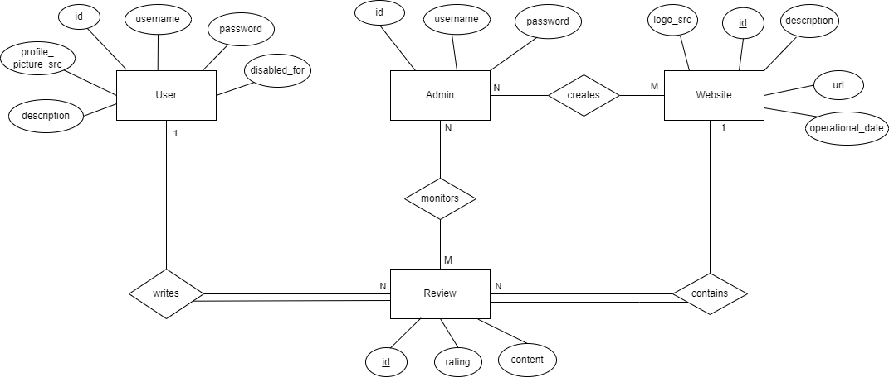
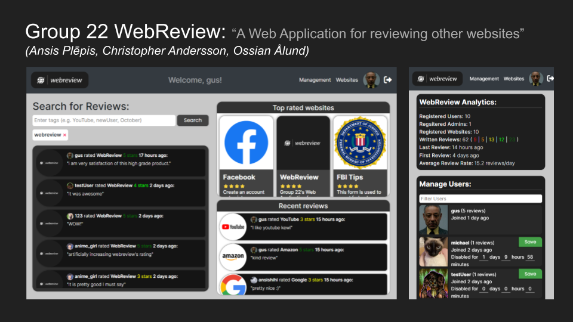

# Backend and Frontend Template

Latest version: https://git.ita.chalmers.se/courses/dit341/group-00-web (public Github [mirror](https://github.com/dit341/group-00-web))
End Product: https://letswebreview.herokuapp.com

## Project Structure

| File        | Purpose           | What you do?  |
| ------------- | ------------- | ----- |
| `server/` | Backend server code | All your server code |
| [server/README.md](server/README.md) | Everything about the server | **READ ME** carefully! |
| `client/` | Frontend client code | All your client code |
| [client/README.md](client/README.md) | Everything about the client | **READ ME** carefully! |
| [docs/DEPLOYMENT.md](docs/DEPLOYMENT.md) | Free online production deployment | Deploy your app online in production mode |
| [docs/LOCAL_DEPLOYMENT.md](docs/LOCAL_DEPLOYMENT.md) | Local production deployment | Deploy your app local in production mode |

## Requirements

The version numbers in brackets indicate the tested versions but feel free to use more recent versions.
You can also use alternative tools if you know how to configure them (e.g., Firefox instead of Chrome).

* [Git](https://git-scm.com/) (v2) => [installation instructions](https://www.atlassian.com/git/tutorials/install-git)
  * [Add your Git username and set your email](https://docs.gitlab.com/ce/gitlab-basics/start-using-git.html#add-your-git-username-and-set-your-email)
    * `git config --global user.name "YOUR_USERNAME"` => check `git config --global user.name`
    * `git config --global user.email "email@example.com"` => check `git config --global user.email`
  * > **Windows users**: We recommend to use the [Git Bash](https://www.atlassian.com/git/tutorials/git-bash) shell from your Git installation or the Bash shell from the [Windows Subsystem for Linux](https://docs.microsoft.com/en-us/windows/wsl/install-win10) to run all shell commands for this project.
* [Chalmers GitLab](https://git.ita.chalmers.se/) => Login with your **Chalmers CID** choosing "Sign in with" **Chalmers Login**. (contact [support@chalmers.se](mailto:support@chalmers.se) if you don't have one)
  * DIT341 course group: https://git.ita.chalmers.se/courses/dit341
  * [Setup SSH key with Gitlab](https://docs.gitlab.com/ee/ssh/)
    * Create an SSH key pair `ssh-keygen -t ed25519 -C "email@example.com"` (skip if you already have one)
    * Add your public SSH key to your Gitlab profile under https://git.ita.chalmers.se/profile/keys
    * Make sure the email you use to commit is registered under https://git.ita.chalmers.se/profile/emails
  * Checkout the [Backend-Frontend](https://git.ita.chalmers.se/courses/dit341/group-00-web) template `git clone git@git.ita.chalmers.se:courses/dit341/group-00-web.git`
* [Server Requirements](./server/README.md#Requirements)
* [Client Requirements](./client/README.md#Requirements)

## Getting started

```bash
# Clone repository
git clone git@git.ita.chalmers.se:courses/dit341/group-00-web.git

# Change into the directory
cd group-00-web

# Setup backend
cd server && npm install
npm run dev

# Setup frontend
cd client && npm install
npm run serve
```

> Check out the detailed instructions for [backend](./server/README.md) and [frontend](./client/README.md).

## Visual Studio Code (VSCode)

Open the `server` and `client` in separate VSCode workspaces or open the combined [backend-frontend.code-workspace](./backend-frontend.code-workspace). Otherwise, workspace-specific settings don't work properly.

## System Definition (MS0)

### Purpose

#### **What?**
***
Allow users to search for reviews and leave reviews on any website there is. :writing_hand:

#### **How?**
***
By building a web app instead of a desktop app, we allow anyone with an internet connection to read and write reviews of the websites they visit. With constant administration reviews are monitored and kept to website standards. :globe_with_meridians: 

#### **Why?**
***
Every person should have the option to voice their opinion on anything and this includes websites. Due to the lack of an undefined site for the review of websites we have decided to step in. :speaking_head: 

### Pages

* **Login:** the landing page of the website, where a user is prompted to login or sign-up if they don't have an existing account. An admin may login as well, but an admin account may not be created here.
* **Register:** Here anyone can create a user account by specifying a username and password. Optionally, a user can write a profile description and upload a profile picture.
* **Home:** Here Users and Admins can browse, search and navigate to many different specific website screens. If logged in, Users/Admins can access their own account screen.
* **Account:** Here users can see details about their account, such as profile picture, description, and all their reviews along with computed statistics (number of reviews, average rating)
* **Website:** Information about the website is presented here along with eventual reviews written by users.

### Entity-Relationship (ER) Diagram



## Teaser (MS3)


